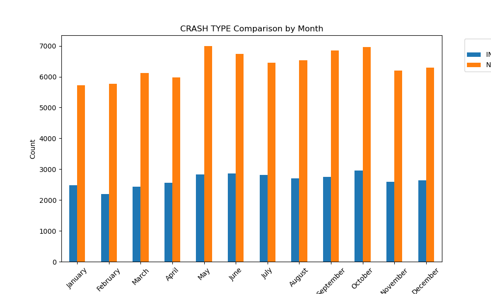
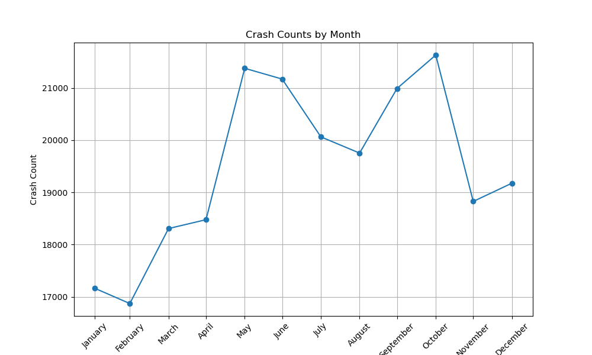
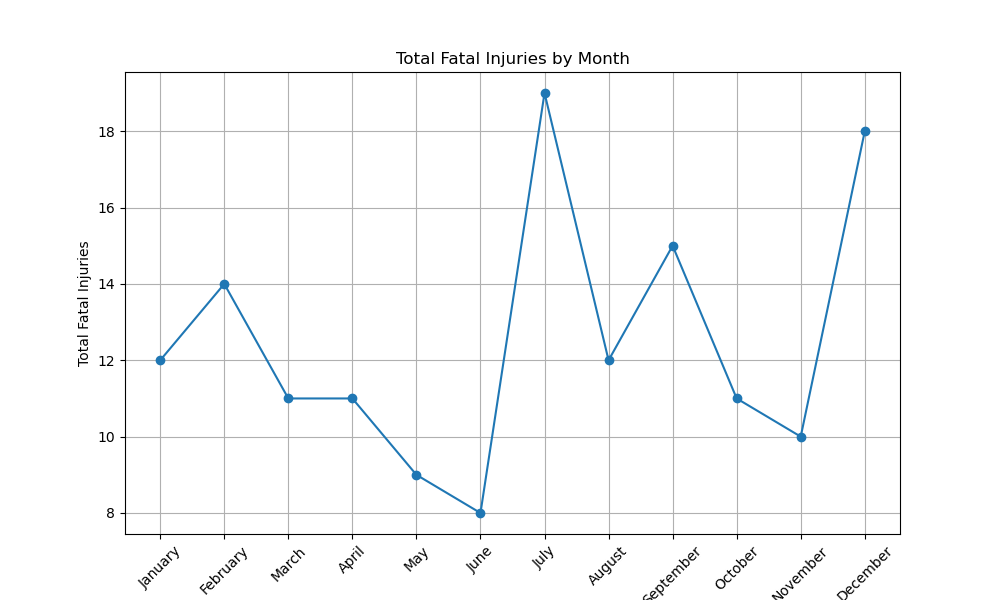
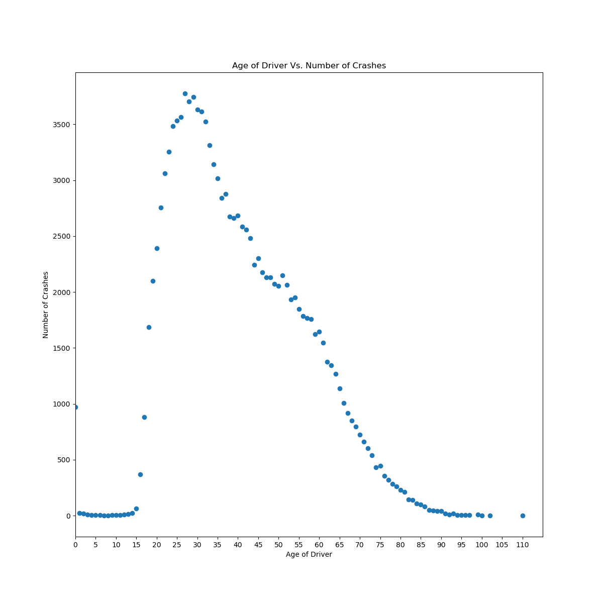

# Analysis of Chicago Traffic Crashes

Group members: Sean Bell (captain), Sonia Singh, Jian Liu, Tony Quintana, Cynthia Saving

Initial Broad Questions We Had: 
When and how is it safest to travel through Chicago, analyzing serious injuries and fatalities in the last year

# Questions We Set Out to Answer

- What are the most fatal months? - Jian Liu
- What are the most common causes of crashes? - Cynthia Saving
- What driver age is most prevalent? - Sonia Singh
- What vehicle age is most common? - Tony Quintana
- What vehicle make is most common? - Sean Bell

# Findings
- The greatest number of crashes take place in October. The greatest number of injuries and/or tow(s) due to crash also take place in October. However, the greatest number of fatal injuries take place in July. 
- Failing to yield right-of-way and following too closely are most common causes of accidents. However, 47% of all accidents and 36% of accidents with injuries do not have primary cause reported.
- Drivers aged 27 to 31 were most frequently in accidents.
- Vehicles made in 2017 had most accidents.
- Chevy passenger vehicles are most common with accidents.

# References: 

https://data.cityofchicago.org/Transportation/Traffic-Crashes-Crashes/85ca-t3if/
https://data.cityofchicago.org/Transportation/Traffic-Crashes-Vehicles/68nd-jvt3/
https://data.cityofchicago.org/Transportation/Traffic-Crashes-People/u6pd-qa9d

#Presentation
https://docs.google.com/presentation/d/1GR0-8_Jc7lK146n9ep_EbJDC3nbN2_L2J5gNWoWjPrc/edit#slide=id.p
